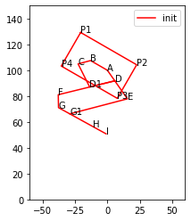
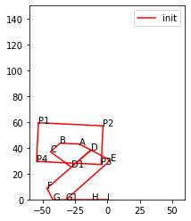
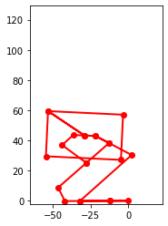

# Bio-inspired Passive Power Attenuation Mechanism for Jumping Robot
[Return Home](/index)

---

# Dynamics II Prep

Task for this week
1. Add payload mass and inertia
2. Add freefall
3. Add ground contact


```python
%matplotlib inline

import pynamics
from pynamics.frame import Frame
from pynamics.variable_types import Differentiable,Constant
from pynamics.system import System
from pynamics.constraint import Constraint
from pynamics.dyadic import Dyadic
from pynamics.output import PointsOutput
from pynamics.particle import Particle
from pynamics.body import Body
import pynamics.integration

import sympy
import numpy as np
import matplotlib.pyplot as plt
from math import pi

from IPython.display import display, clear_output
import time
```

## Payload
A payload is added to the dynamic model. The payload is assumed to be a box of the same density of the link. The center of the payload(Frame P origin) is coincident with the Frame A origin. Specific dimension will be determined later.


```python
# Simulation values
DEG_TO_RAD = pi/180

# Unit scaling
M_TO_L = 1e3 # mm
KG_TO_W = 1e3 # g
S_TO_T = 1e1 # 0.1s

fps = 30
tfinal = 0.8*S_TO_T

h_drop = 0.1*M_TO_L # drop height

# Initial input joint angle
qP_i = -30*DEG_TO_RAD
qA_i = -25*DEG_TO_RAD
qB_i = -135*DEG_TO_RAD
qC_i = 1.7737409743635988
qD_i = -1.9405628086550872
qG_i = 60*DEG_TO_RAD
qH_i = 0*DEG_TO_RAD

# {
#     xP: 0.0, yP: 100.0, qP: -0.6981317007977318,
#     qA: -0.4363323129985824, qB: -2.356194490192345, qG: 1.0471975511965976, qH: 0.0,
#     qC: 1.7737409743635988, qD: -1.9405628086550872, qF: 1.3490306684449318, qE: -1.9256382910474987
# }    


rho = 1240*KG_TO_W/M_TO_L**3 # density

lp_v = 0.05*M_TO_L # payload length
wp_v = 0.03*M_TO_L # payload width
tp_v = 0.03*M_TO_L # payload thickness

w_v = 0.03*M_TO_L # link width
t_v = 0.003*M_TO_L # link thickness

ln_v = 0.015*M_TO_L # link length
la1_v = 0.010*M_TO_L
la2_v = 0.017*M_TO_L
lb_v = 0.010*M_TO_L
lc_v = 0.020*M_TO_L
ld1_v = 0.020*M_TO_L
ld2_v = 0.025*M_TO_L
le_v = 0.046*M_TO_L
lf_v = 0.010*M_TO_L
lg1_v = 0.010*M_TO_L
lg2_v = 0.020*M_TO_L
lh_v = 0.012*M_TO_L

# Mass value
mP_v = lp_v*wp_v*tp_v*rho
mA_v = (la1_v+la2_v)*w_v*t_v*rho
mB_v = lb_v*w_v*t_v*rho
mC_v = lc_v*w_v*t_v*rho
mD_v = (ld1_v+ld2_v)*w_v*t_v*rho
mE_v = le_v*w_v*t_v*rho
mF_v = lf_v*w_v*t_v*rho
mG_v = (lg1_v+lg2_v)*w_v*t_v*rho
mH_v = lh_v*w_v*t_v*rho

print('Payload mass', mP_v)
print('Total mass', mP_v+mA_v+mB_v+mC_v+mD_v+mE_v+mF_v+mG_v+mH_v)
```

    Payload mass 55.8
    Total mass 78.12


## Freefall
Instead of attaching the linkage directly to the newtonian frame. The linkage is now attached to the payload frame. The payload frame is then able to move freely in the newtonian frame descriped by x, y, and angle differentiable variables.


```python
# Variables, constants, and frames
system = System()
pynamics.set_system(__name__,system)

lp = Constant(lp_v,'lp',system)
tp = Constant(tp_v,'tp',system)

ln = Constant(ln_v,'ln',system)
la1 = Constant(la1_v,'la1',system)
la2 = Constant(la2_v,'la2',system)
lb = Constant(lb_v,'lb',system)
lc = Constant(lc_v,'lc',system)
ld1 = Constant(ld1_v,'ld1',system)
ld2 = Constant(ld2_v,'ld2',system)
le = Constant(le_v,'le',system)
lf = Constant(lf_v,'lf',system)
lg1 = Constant(lg1_v,'lg1',system)
lg2 = Constant(lg2_v,'lg2',system)
lh = Constant(lh_v,'lh',system)

mP = Constant(mP_v,'mP',system)
mA = Constant(mA_v,'mA',system)
mB = Constant(mB_v,'mB',system)
mC = Constant(mC_v,'mC',system)
mD = Constant(mD_v,'mD',system)
mE = Constant(mE_v,'mE',system)
mF = Constant(mF_v,'mF',system)
mG = Constant(mG_v,'mG',system)
mH = Constant(mH_v,'mH',system)

# Gravity
g = Constant(9.81*M_TO_L/S_TO_T**2,'g',system) # m/s^2

# Damping and spring constant
# angular damping, kg*m/s^2*m/(rad/s)
# angular spring constant, kg*m/s^2*m/rad
# Joint G
b = Constant(1e-3*KG_TO_W*M_TO_L**2/S_TO_T,'b',system)
k = Constant(5e-2*KG_TO_W*M_TO_L**2/S_TO_T**2,'k',system)

# Joint H
bh = Constant(1e-3*KG_TO_W*M_TO_L**2/S_TO_T,'bh',system)
kh = Constant(5e-2*KG_TO_W*M_TO_L**2/S_TO_T**2,'kh',system)

# Other joints
bj = Constant(1e-3*KG_TO_W*M_TO_L**2/S_TO_T,'bj',system)
kj = Constant(5e-2*KG_TO_W*M_TO_L**2/S_TO_T**2,'kj',system)

# Floor damping and spring constant
bf = Constant(1e-5*KG_TO_W*M_TO_L**2/S_TO_T,'bf',system)
kf = Constant(1e-3*KG_TO_W*M_TO_L**2/S_TO_T**2,'kf',system)

# Payload linear and angular varibale
xP,xP_d,xP_dd = Differentiable('xP',system)
yP,yP_d,yP_dd = Differentiable('yP',system)
qP,qP_d,qP_dd = Differentiable('qP',system)

qA = Constant(qA_i,'qA',system)
qB = Constant(qB_i,'qB',system)
qC = Constant(qC_i,'qC',system)
qD = Constant(qD_i,'qD',system)

# qA,qA_d,qA_dd = Differentiable('qA',system)
# qB,qB_d,qB_dd = Differentiable('qB',system)
# qC,qC_d,qC_dd = Differentiable('qC',system)
# qD,qD_d,qD_dd = Differentiable('qD',system)
qE,qE_d,qE_dd = Differentiable('qE',system)
qF,qF_d,qF_dd = Differentiable('qF',system)
qG,qG_d,qG_dd = Differentiable('qG',system)
qH,qH_d,qH_dd = Differentiable('qH',system)

qG1 = pi-(3*pi-(pi+qE)-(pi-qF)-(pi-qG)-(-qD))

state_variables = system.get_state_variables()

N = Frame('N')
P = Frame('P')
A = Frame('A')
B = Frame('B')
C = Frame('C')
D = Frame('D')
E = Frame('E')
F = Frame('F')
G = Frame('G')
H = Frame('H')

G1 = Frame('G1')

system.set_newtonian(N)
```


```python
# Kinemactics
P.rotate_fixed_axis_directed(N,[0,0,1],qP,system)
A.rotate_fixed_axis_directed(P,[0,0,1],qA,system)
B.rotate_fixed_axis_directed(P,[0,0,1],qB,system)
C.rotate_fixed_axis_directed(B,[0,0,1],qC,system)
D.rotate_fixed_axis_directed(A,[0,0,1],qD,system)
E.rotate_fixed_axis_directed(A,[0,0,1],qE,system)
F.rotate_fixed_axis_directed(D,[0,0,1],qF,system)
G.rotate_fixed_axis_directed(F,[0,0,1],qG,system)
H.rotate_fixed_axis_directed(G,[0,0,1],qH,system)

G1.rotate_fixed_axis_directed(G,[0,0,1],qG1,system)

# Joints
pNP = xP*N.x+yP*N.y
pNA = pNP+0*P.x
pNB = pNP-ln*P.x
pNC = pNB + lb*B.x
pND = pNA + la1*A.x
pND1 = pNC + lc*C.x
pND1_p = pND + ld1*D.x
pNE = pNA + (la1+la2)*A.x
pNF= pND + (ld1+ld2)*D.x
pNG = pNF + lf*F.x
pNG1 = pNG + lg1*G.x
pNG1_p = pNE + le*E.x
pNH = pNG+(lg1+lg2)*G.x
pNI = pNH+lh*H.x # Toe

# Payload
pNPC = pNP-ln/2*P.x # Center
pNP1 = pNPC-lp/2*P.x+tp/2*P.y # top left
pNP2 = pNPC+lp/2*P.x+tp/2*P.y # top right
pNP3 = pNPC+lp/2*P.x-tp/2*P.y # bottom right
pNP4 = pNPC-lp/2*P.x-tp/2*P.y # bottom left

# Center of mass
pPm = pNPC
pAm = pNA + (la1+la2)/2*A.x
pBm = pNB + lb/2*B.x
pCm = pNC + lc/2*C.x
pDm = pND + (ld1+ld2)/2*D.x
pEm = pNE + le/2*E.x
pFm = pNF + lf/2*F.x
pGm = pNG + (lg1+lg2)/2*G.x
pHm = pNH + lh/2*H.x
```


```python
# Constraints
eq = [
#     xP, yP-h_drop, qP-qP_i,
#     qA-qA_i, qB-qB_i,
#     qG-qG_i,
    qH-qH_i,    
    (pNG1-pNG1_p).dot(P.x),
    (pNG1-pNG1_p).dot(P.y),
]
eq_d=[(system.derivative(e)) for e in eq]
eq_dd=[(system.derivative(e)) for e in eq_d]
```


```python
# Position given inputs

# Numerically solve for position of the points based on inputs
def solve_position(qi,qd,points):
    c = Constraint(eq)

    # Make qi constant beacuse it is the input in fk
    constants = system.constant_values.copy()
    constants.update(dict([(q,qi[q]) for q in qi]))

    variables = list(qi.keys())+list(qd.keys())
    guess = []
    for v in variables:
        if v in qi:
            guess.append(qi[v])
        elif v in qd:  
            guess.append(qd[v])
        else:
            guess.append(0)
    result = c.solve_numeric(variables,guess,constants) # Solve based on added constants

    sv_values = []
    for sv in system.get_state_variables():
        if sv in variables:
            sv_values.append(result.x[variables.index(sv)])
        else:
            sv_values.append(0) # Assume zero speed, will not affect point locations

    points_output = PointsOutput(points, constant_values=system.constant_values)
    points_output.calc(np.array([sv_values,sv_values]))

    x = {}
    for i, v in enumerate(variables):
        x[v] = result.x[i]

    return x, points_output.y[0,:,:]

def plot(ps, c='r', l='test'):
    ps_ADD1CB = np.array([
        ps[0,:],
        ps[3,:],
        ps[4,:],
        ps[2,:],
        ps[1,:],
        ps[0,:],
    ])
    ps_DEG1GF = np.array([
        ps[3,:],
        ps[5,:],
        ps[8,:],
        ps[7,:],
        ps[6,:],
        ps[3,:],
    ])    
    ps_G1HI = np.array([
        ps[8,:],
        ps[9,:],
        ps[10,:]
    ])    
    ps_P1P2P3P4 = np.array([
        ps[11,:],
        ps[12,:],
        ps[13,:],
        ps[14,:],
        ps[11,:]
    ])   

    plt.plot(ps_P1P2P3P4[:,0],ps_P1P2P3P4[:,1],c)
    for p, label in zip(ps_P1P2P3P4[:-1,:],['P1','P2','P3','P4']):
        plt.text(p[0],p[1],label)

    plt.plot(ps_ADD1CB[:,0],ps_ADD1CB[:,1],c)
    for p, label in zip(ps_ADD1CB[:-1,:],['A','D','D1','C','B']):
        plt.text(p[0],p[1],label)

    plt.plot(ps_DEG1GF[:,0],ps_DEG1GF[:,1],c)
    for p, label in zip(ps_DEG1GF[1:-1,:],['E','G1','G','F']):
        plt.text(p[0],p[1],label)

    plt.plot(ps_G1HI[:,0],ps_G1HI[:,1],c)
    for p, label in zip(ps_G1HI[1:,:],['H','I']):
        plt.text(p[0],p[1],label)

    plt.plot([],c,label=l)
    plt.axis('scaled')
    plt.xlim(-0.06*M_TO_L,0.06*M_TO_L)
    plt.ylim(-0.0*M_TO_L,h_drop+0.05*M_TO_L)
    plt.legend()

points_plot = [pNA,pNB,pNC,pND,pND1,pNE,pNF,pNG,pNG1,pNH,pNI,pNP1,pNP2,pNP3,pNP4]    
```


```python
# Test Plots
qs1,ps1 = solve_position(
    {xP:0, yP:h_drop, qP:qP_i, qG:qG_i, qH:qH_i}, # Input value
    {qF:90*DEG_TO_RAD, qE:-90*DEG_TO_RAD}, # Guess values
    points_plot # Points to calculate, use this order to ensure plot is correct
)

plt.figure()
plot(ps1, c='r', l='init')
```

    2021-03-19 04:33:36,664 - pynamics.output - INFO - calculating outputs
    2021-03-19 04:33:36,666 - pynamics.output - INFO - done calculating outputs





```python
# Intertias
Ixx_P = Constant(mP_v*(wp_v**2+tp_v**2)/12, 'Ixx_P', system)
Iyy_P = Constant(mP_v*(lp_v**2+wp_v**2)/12, 'Iyy_P', system)
Izz_P = Constant(mP_v*(lp_v**2+tp_v**2)/12, 'Izz_P', system)
IP = Dyadic.build(P,Ixx_P,Iyy_P,Izz_P)

Ixx_A = Constant(mA_v*(w_v**2+t_v**2)/12, 'Ixx_A', system)
Iyy_A = Constant(mA_v*((la1_v+la2_v)**2+w_v**2)/12, 'Iyy_A', system)
Izz_A = Constant(mA_v*((la1_v+la2_v)**2+t_v**2)/12, 'Izz_A', system)
IA = Dyadic.build(A,Ixx_A,Iyy_A,Izz_A)

Ixx_B = Constant(mB_v*(w_v**2+t_v**2)/12, 'Ixx_B', system)
Iyy_B = Constant(mB_v*(lb_v**2+w_v**2)/12, 'Iyy_B', system)
Izz_B = Constant(mB_v*(lb_v**2+t_v**2)/12, 'Izz_B', system)
IB = Dyadic.build(B,Ixx_B,Iyy_B,Izz_B)

Ixx_C = Constant(mC_v*(w_v**2+t_v**2)/12, 'Ixx_C', system)
Iyy_C = Constant(mC_v*(lc_v**2+w_v**2)/12, 'Iyy_C', system)
Izz_C = Constant(mC_v*(lc_v**2+t_v**2)/12, 'Izz_C', system)
IC = Dyadic.build(C,Ixx_C,Iyy_C,Izz_C)

Ixx_D = Constant(mD_v*(w_v**2+t_v**2)/12, 'Ixx_D', system)
Iyy_D = Constant(mD_v*((ld1_v+ld2_v)**2+w_v**2)/12, 'Iyy_D', system)
Izz_D = Constant(mD_v*((ld1_v+ld2_v)**2+t_v**2)/12, 'Izz_D', system)
ID = Dyadic.build(D,Ixx_D,Iyy_D,Izz_D)

Ixx_E = Constant(mE_v*(w_v**2+t_v**2)/12, 'Ixx_E', system)
Iyy_E = Constant(mE_v*(le_v**2+w_v**2)/12, 'Iyy_E', system)
Izz_E = Constant(mE_v*(le_v**2+t_v**2)/12, 'Izz_E', system)
IE = Dyadic.build(E,Ixx_E,Iyy_E,Izz_E)

Ixx_F = Constant(mF_v*(w_v**2+t_v**2)/12, 'Ixx_F', system)
Iyy_F = Constant(mF_v*(lf_v**2+w_v**2)/12, 'Iyy_F', system)
Izz_F = Constant(mF_v*(lf_v**2+t_v**2)/12, 'Izz_F', system)
IF = Dyadic.build(F,Ixx_F,Iyy_F,Izz_F)

Ixx_G = Constant(mG_v*(w_v**2+t_v**2)/12, 'Ixx_G', system)
Iyy_G = Constant(mG_v*((lg1_v+lg2_v)**2+w_v**2)/12, 'Iyy_G', system)
Izz_G = Constant(mG_v*((lg1_v+lg2_v)**2+t_v**2)/12, 'Izz_G', system)
IG = Dyadic.build(G,Ixx_G,Iyy_G,Izz_G)

Ixx_H = Constant(mH_v*(w_v**2+t_v**2)/12, 'Ixx_H', system)
Iyy_H = Constant(mH_v*(lh_v**2+w_v**2)/12, 'Iyy_H', system)
Izz_H = Constant(mH_v*(lh_v**2+t_v**2)/12, 'Izz_H', system)
IH = Dyadic.build(H,Ixx_H,Iyy_H,Izz_H)
```

# Ground contact
Ground contact is modeled as two forces. The floor is considered as a line at y equals 0. The forces are zero if points are not in contact with the floor.Damping and spring forces happen when the points on the linkage are in contact. Three contact points are assumed at G, G1, and H.


```python
# Dynamics
BodyP = Body('BodyP',P,pPm,mP,IP,system)
BodyA = Body('BodyA',A,pAm,mA,IA,system)
BodyB = Body('BodyB',B,pBm,mB,IB,system)
BodyC = Body('BodyC',C,pCm,mC,IC,system)
BodyD = Body('BodyD',D,pDm,mD,ID,system)
BodyE = Body('BodyE',E,pEm,mE,IE,system)
BodyF = Body('BodyF',F,pFm,mF,IF,system)
BodyG = Body('BodyG',G,pGm,mG,IG,system)
BodyH = Body('BodyH',H,pHm,mH,IH,system)

# Contact Force
contact_points = {
    'G': pNG,
    'G1': pNG1,
    'H': pNH,
    'I': pNI
}
contact_forces = {}
# Assume floor is at yN = 0
for key in contact_points:
    v = contact_points[key]
    yV = v.dot(N.y)
    dV = (sympy.Abs(yV)-yV)/2 # If above floor, distance is 0, else y
    vV = v.time_derivative(N,system)

    # Floor acts as spring and damper only when in contact
    fspring = kf*dV*N.y
    fdamping = -bf*dV*vV

    system.addforce(fspring,vV) # Spring vertical up
    system.addforce(fdamping,vV) # Damper against velocity

    contact_forces[key] = [fspring,fdamping]

# Joint Force
FwG = F.getw_(G)
system.addforce(-b*FwG,FwG)
system.add_spring_force1(k,(qG-qG_i)*F.z,FwG)

GwH = G.getw_(H)
system.addforce(-bh*GwH,GwH)
system.add_spring_force1(kh,(qH-qs1[qH])*H.z,GwH)

DwF = D.getw_(F)
system.addforce(-bj*DwF,DwF)
system.add_spring_force1(kj,(qF-qs1[qF])*D.z,DwF)

DwE = D.getw_(E)
system.addforce(-bj*DwE,DwE)
system.add_spring_force1(kj,(qE-qs1[qE])*D.z,DwE)

GwG1 = G.getw_(G1)
system.addforce(-bj*GwG1,GwG1)
system.add_spring_force1(kj,(qG1-qG1.subs(qs1))*G.z,GwG1)

# Gravity
system.addforcegravity(-g*N.y)
```


```python
# Simulate
tol = 1e-9
t = np.arange(0,tfinal,1/fps) # 30fps

# Initial conditions
states_init_d = qs1
states_init = []
for sv in state_variables:
    if sv in qs1:
        states_init.append(states_init_d[sv])
    else:
        states_init.append(0)   
#         if sv == qP_d:
#             states_init.append(0.01*M_TO_L/S_TO_T)
#         else:
#             states_init.append(0)   

f,ma = system.getdynamics()
f_s, f_c = system.state_space_post_invert(f,ma,eq_dd,return_lambda=True)
states = pynamics.integration.integrate(f_s,states_init,t,rtol=tol,atol=tol, args=({'constants':system.constant_values},))
```

    2021-03-19 04:33:37,221 - pynamics.system - INFO - getting dynamic equations
    2021-03-19 04:33:40,054 - pynamics.system - INFO - solving a = f/m and creating function
    2021-03-19 04:33:40,105 - pynamics.system - INFO - substituting constrained in Ma-f.
    2021-03-19 04:34:18,914 - pynamics.system - INFO - done solving a = f/m and creating function
    2021-03-19 04:34:18,915 - pynamics.system - INFO - calculating function for lambdas
    2021-03-19 04:34:18,916 - pynamics.integration - INFO - beginning integration
    2021-03-19 04:34:18,916 - pynamics.system - INFO - integration at time 0000.00
    2021-03-19 04:35:28,148 - pynamics.system - INFO - integration at time 0001.08
    2021-03-19 04:36:35,801 - pynamics.system - INFO - integration at time 0001.31
    2021-03-19 04:37:41,243 - pynamics.system - INFO - integration at time 0001.52
    2021-03-19 04:38:46,080 - pynamics.system - INFO - integration at time 0001.91
    2021-03-19 04:39:49,882 - pynamics.system - INFO - integration at time 0002.29
    2021-03-19 04:40:55,196 - pynamics.system - INFO - integration at time 0003.52
    2021-03-19 04:41:58,920 - pynamics.system - INFO - integration at time 0004.32
    2021-03-19 04:43:02,845 - pynamics.system - INFO - integration at time 0006.64
    2021-03-19 04:43:12,979 - pynamics.integration - INFO - finished integration


```python
def animate(states):
    points_output = PointsOutput(points_plot,system)
    outputs = points_output.calc(states)    

    fig = plt.figure()
    for pts in outputs:
        plt.cla()
        plot(pts, c='r', l='init')
        display(fig)
        clear_output(wait=True)
        time.sleep(1/fps)   

    return points_output

points_output = animate(states)        
```





```python
# # Contact vertical speed
# plt.plot(states[:,state_variables.index(yP_d)])
# print(np.min(states[:,state_variables.index(yP_d)]))
```


```python
# Save video
points_output = PointsOutput([pNPC,pNP1,pNP2,pNP3,pNP4,pNP1,pNPC,pNA,pND,pND1,pNC,pNB,pNA,pND,pNE,pNG1,pNH,pNI,pNH,pNG1,pNG,pNF,pND1],system)
points_output.calc(states)    
points_output.animate(fps,movie_name='leg.mp4',lw=2,marker='o',color=(1,0,0,1),linestyle='-')
```

    2021-03-19 04:44:14,109 - pynamics.output - INFO - calculating outputs
    2021-03-19 04:44:14,282 - pynamics.output - INFO - done calculating outputs


    <AxesSubplot:>





## Simulation Video
Here is the video of the simualtion using above values. By changing values to ones obtained from experiment, the simulation can represent the physical system better. It will also serve as an evaluation tool for iterating the design to achieve passive stable landing.

<video controls src="img/dynamicsiiprepfuchen/leg.mp4"/>
