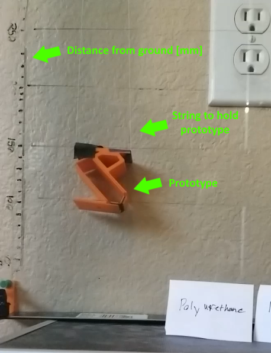
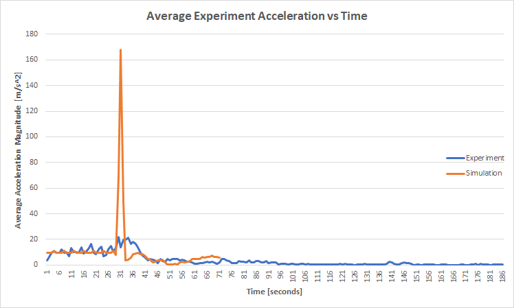

# Bio-inspired Passive Power Attenuation Mechanism for Jumping Robot
[Return Home](/index)

---

# **Data Collection and Experimental Validation Report**
Team 6 Members:

Cole Brauer @ cbrauer@asu.edu

Fuchen Chen @ fchen65@asu.edu

Nathaniel Rossi @ ntrossi@asu.edu

Mason Smith @ mosmith3@asu.edu

## **Procedure and Results**

The team settled on 3 material choices for the final damper material. Transparant film (control), rubber, and polyeurathane. Of the 3, the polyeurathane was the most successful in its landing stability in the experimental results and therefore was used for the rest of this analysis.

To test the landing stability of the mechanism, the following steps were taken:

1. Built a testing platform consisting of two glass panels which prevent the test system from rotating in two axes.

2. Positioned a camera perpendicular to the test rig to record video for later analysis.

3. Positioned the final prototype with the bottom foot 10cm above the ground. The prototype was held in place with light string.

4. The string holding the mechanism was released, allowing the prototype to fall, which was recorded in 240fps.

5. This experiment was repeated 5 times.

6. Using the tracker software, each video was analyzed by using point 1 to track the motion of the device.

7. The output of each video analysis was averaged.

Video link to of one of the experiments:
https://youtu.be/sDl8Qv2XFEM

###**Results**

Summarized in the table below are the results of each experiment and the simulation.

| Trial | Max Acceleration | Settling Time |
|-------|------------------|---------------|
| 1     | 47.98            | 0.3039        |
| 2     | 24.64            | 0.4375        |
| 3     | 24.91            | 0.3500        |
| 4     | 24.93            | 0.4167        |
| 5     | 21.94            | 0.6417        |
| Simulation | 167.88      | 0.1667        |

Below is a plot of the y-axis position of the experiment vs simulation and acceleration for experiment vs simulation.

## **Discussion**

**1. What do you consider the top five sources of error in your data collection experiment?**

1. *Drop Conditions*: Variation in drop angle. While the drop rig is designed to keep the part from rotating along two axises, the device is free to rotate in the other. Because the center of gravity is not centered when first released, the device rotates before hitting the ground. This was not considered in the simulation and could introduce sources of error.

2. *Prototype Construction*:When manufacturing the prototypes, super glue was used to bond the links to the flexible joint material.  However, the glue spread out past the link making some of the joints more rigid. Also, all prototypes were assembled by hand making parameters like joint lengths subject to human error.

3. *Video Recording*:The initial recording of the experiment is subject to conditions of the environment. Lighting conditions or the color of each complete prototype may introduce errors in the software tracking the device. While the data output of the data collection was cleaned, it will never be as exact as the simulation data. Also, the camera perspective can skew points that are mapped with the height indicators on the glass panel.

4. *Marker Tracking*: The Tracker software tracks the marker on the robot by searching for the most similar color in the same region as a previous point.  However, the tracker assumes that the position is a point mass. Because the marker has a height and width, the tracked point can randomly move within this area and cause noise in the observed position.

5. *Interaction forces when falling*: Although the friction between the robot and the glass panel is likely negligible, the collisions between them may not be. In order to allow the robot to freely fall, the gap between the glass panel and the wall must be slightly larger than the robot.  This allows the robot to spin in an unwanted direction and possibly slow the fall or change the rotation dynamics.

**2. What steps did you take to reduce the error?**

As mentioned previously, the rig is designed to ensure the prototype does not rotate on the way down. This was done by closely matching the width of the leg to minimize rotation not in the 2d plane. Height markers were drawn on the face of the panel to provide a consistent reference for the drop height. Additionally, this panel was made of glass to reduce friction and unwanted forces while falling.

Also, dropping the robot by hand can often cause disturbances to the initial conditions because of the points of contact being released at different times. To mitigate this, the robot was released by letting go of a string.The string also ensures the prototype drops from a consistent drop position and rotation. Also, this allows for a zero velocity and zero angular velocity.

To improve the quality of the video analysis with Tracker, quality lighting conditions were set with multiple lights were used in addition to recording close to a window for natural light. High contrast markers were also placed on the observation points on the leg to allow Tracker to more easily track the color.

**3. What was difficult to control?**

Although the string allowed for consistent drop height and initial conditions $(y',y", θ’)$ it was difficult to manually adjust the initial rotation $θ$. Additionally, managing the dropping procedure and the video recording was cumbersome. The slow motion video capture did not allow unlimited footage to be recorded. Therefore, adjusting the robot had a time constraint placed on it which made it difficult to drop the robot from valid initial conditions.

**4. How would you improve your testing setup or procedure next time?**

The main improvement for the test procedure would be to change the dropping method.A platform that falls out from underneath the robot would help remove some of the human error introduced to initial conditions with the string. Also, If the string drop method was still being used, having two experimenters would help allow the dropper focus on maintaining accurate initial conditions instead of managing the video recording.

**5. How well does your data mirror your simulated results? What is similar, what is different?**
The first significant discrepancy that was noticed was the difference between the modeled and prototype actuator dynamics. Although the experimental values for damping and stiffness coefficients were likely accurate, the model assumed the joint was attached perpendicularly instead under stress at equilibrium. This caused the force from all materials to increase making the dynamics of all systems change. This had the apparent effect of increasing stiffness of all actuators.

This had significant effects on the observed material performance. In simulation, the rubber material was the only actuator to be able to support the weight of the robot and not collapse. However, the actuator joint for the rubber robot was much stiffer in practice and caused the robot to have an unstable equilibrium when standing, let alone being dropped. Due to this, the robot was not able to achieve a consistent stable landing position during landing. The closest result to achieving a landing was when it achieved stability on the heel with is not characteristic of a stable landing position.

Similarly, the increased stiffness for polyurethane enabled it to support the weight of the robot and successfully achieve a stable landing. This is  in contrast to the simulation where it collapsed under its own weight.
Opposed to simulation where contact with the ground was maintained after initial touchdown, experimental results showed that the robots had a much higher restitution and often bounced several times. This could possibly be caused by non-ideal initial conditions allowing a single actuator to be loaded when a singular point of contact at the heel or toe absorbs the impact. Consequently, this could cause a a higher reaction force on that joint instead than if the impact would have been distributed across multiple joints.

**6. Is it possible to add a modeling element which models/captures discrepencies between these two results? What element if added to your simulation what have the biggest impact on its fidelity?**

One cause for the discrepancy between simulation and experiments is that there are parameters where the explicit value is not known. An element of uncertainty in parameters could be added during the modeling and optimization to find a system that would represent the range of uncertain parameters.

Similarly, adding a stochastic perturbation during modeling can account for unknown changes in the dynamics of the system and inputs that were not considered in the model. This would help account for error by considering exogenous inputs that are then added to the known system dynamics only during the experimental trials.

**7. What additional equations and parameters would you need in order to add this element?**

An example for modeling uncertainty would be to define the joint lengths to be within the range of $l_{joint} \in [2.8,3.2]\,mm$ instead of  a discrete value like $l_{join} = 3\,mm$. Doing this would help account for error in manufacturing of the devices. Optimization of the system parameters could then find a solution that is optimal across the full range of uncertain parameters.The same idea can be used for variability in the initial conditions x0 to account for error in drop position and orientation variability caused by human input.
Modeling error as disturbances

Unknown inputs can cause additional changes in the system dynamics x that were not initially defined. The effects of the unknown inputs on the system states can be modeled as $x = [x, x’, θ, θ’] + n_{process}$ where “noise” is added to represent the effect of unknown or unmodeled inputs on the states. For example, the robot bouncing between the glass panel and the wall could have changed the rotation of the robot during freefall which can be modeled as $θ’+θ’_{rand}$.
