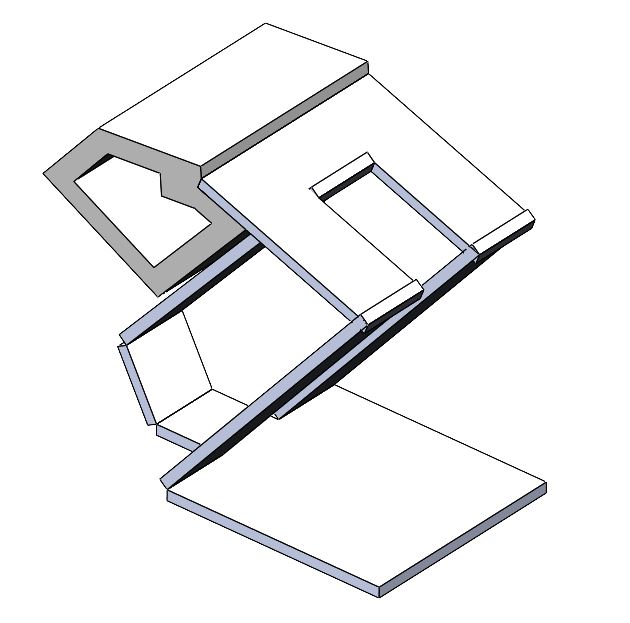
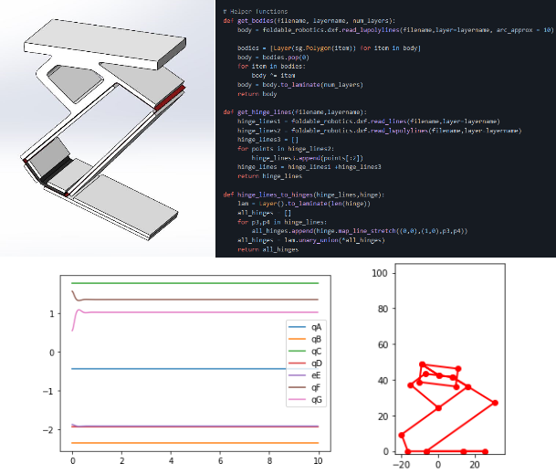

# Bio-inspired Passive Power Attenuation Mechanism for Jumping Robot

---

# Home

## Team 6 Members:

Cole Brauer @ cbrauer@asu.edu\
Fuchen Chen @ fchen65@asu.edu\
Nathaniel Rossi @ ntrossi@asu.edu\
Mason Smith @ mosmith3@asu.edu

## Introduction

In recent years, bipedal robots have been becoming a more feasible means for achieving locomotion. Consequently, much research has been dedicated to investigating how to make these robots' gait as robust as possible. The interest in this field as a whole relates to the distinct advantage of a bipedal robot to transverse dynamic terrain that would otherwise be impossible for a wheeled system to overcome. However, this context implies that dynamic movements like jumping and hopping may be required or even be deemed as the optimal mode of locomotion by a robot. To this end, this research is dedicated to improving conditions for a stable landing position for robots that are subject to this requirement. Furthermore, bio-inspiration is a fundamental principle that is repeatedly referenced during the development of this system since many animals, like the kangaroo rat, have already developed mechanisms to address this problem.

## Research Question

How can a jumping biped robot be constructed to dissipate kinetic energy upon landing and passively achieve a stable standing position?

Specifically, this research pertains to methods for achieving efficient power attenuation which is in contrast to the common focus on power conservation or recovery found in the literature.  Additionally, the system will use laminate manufacturing methods to create a passive joint that achieves the desired system behavior.

[link to full research question section](/researchquestion)

## Background and Biomechanics

The design of the project hardware is inspired by the locomotion of the kangaroo rat. Kangaroo rats’ hind limbs allow them to perform repetitive, high-speed jumping and landing motions during their gait cycle. They also are of a similar scale to the target system size.

[link to full background section](/background)

## Kinematics

A kinematic model is developed based on the hindlimb of a kangaroo rat. Force/torque and velocity are estimated based on the Jacobian and data from biomechanics.

[link to full system kinematics section](/kinematics)

## Dynamics I

A dynamic model is developed to simulate the system interacting with ground forces.

[link to full system dynamics section](/dynamicsi)

## Presentation I

Recording of our team's first presentation.

<iframe width="560" height="315" src="https://www.youtube-nocookie.com/embed/hoA4KZbpxvk" frameborder="0" allow="accelerometer; autoplay; clipboard-write; encrypted-media; gyroscope; picture-in-picture" allowfullscreen></iframe>

## Dynamics II Prep (Parameter ID)

Each member was delegated tasks in preparation for dynamics II, each member’s contribution is linked below.

[Cole Brauer - Rubber Characterization](https://nbviewer.jupyter.org/urls/mosmith3asu.github.io/dynamics-2-prep-cole.ipynb)\
[Fuchen Chen - Refined Dynamics](/dynamicsiiprepfuchen)\
[Nathaniel Rossi - Physical Prototype](https://nbviewer.jupyter.org/urls/mosmith3asu.github.io/EGR557_Dynamics_II_Prep_Nathaniel_Rossi.ipynb)\
[Mason Smith - Experimental Testing Setup](https://nbviewer.jupyter.org/urls/mosmith3asu.github.io/DynamicsPrep_Mason.ipynb)

## System Dynamics II

The dynamic model is updated to consider material parameterization.

[link to full system dynamics II section](https://nbviewer.jupyter.org/urls/mosmith3asu.github.io/code/dyncamicsii.ipynb)

## Presentation II

Recording of our team's second presentation.

<iframe width="560" height="315" src="https://www.youtube.com/embed/EKJCo6YdBzc" title="YouTube video player" frameborder="0" allow="accelerometer; autoplay; clipboard-write; encrypted-media; gyroscope; picture-in-picture" allowfullscreen></iframe>

## Design Optimization

[link to full design optimization section](https://nbviewer.jupyter.org/urls/mosmith3asu.github.io/code/design_optimization.ipynb)

## Manufacturing
The laminate robot manufacturing process is planned using SolidWorks and Python foldable_robotics package. All the cut files are generated.

[link to full manufacturing section](/manufacturing)

## Experimental Validation
Experiments are performed to validate the simulation.

<iframe width="560" height="315" src="https://www.youtube.com/embed/sDl8Qv2XFEM" title="YouTube video player" frameborder="0" allow="accelerometer; autoplay; clipboard-write; encrypted-media; gyroscope; picture-in-picture" allowfullscreen></iframe>

[link to full experimental validation	section](/experiment)

## Presentation III
Recording of our team's third and final presentation.

<iframe width="560" height="315" src="https://www.youtube.com/embed/Tfui9wJ9ZXI" title="YouTube video player" frameborder="0" allow="accelerometer; autoplay; clipboard-write; encrypted-media; gyroscope; picture-in-picture" allowfullscreen></iframe>

## Files
All the CAD models, designs, data, and code related to this projects can be accessed [here](https://github.com/mosmith3asu/mosmith3asu.github.io)

## References
[link to references](/references)
